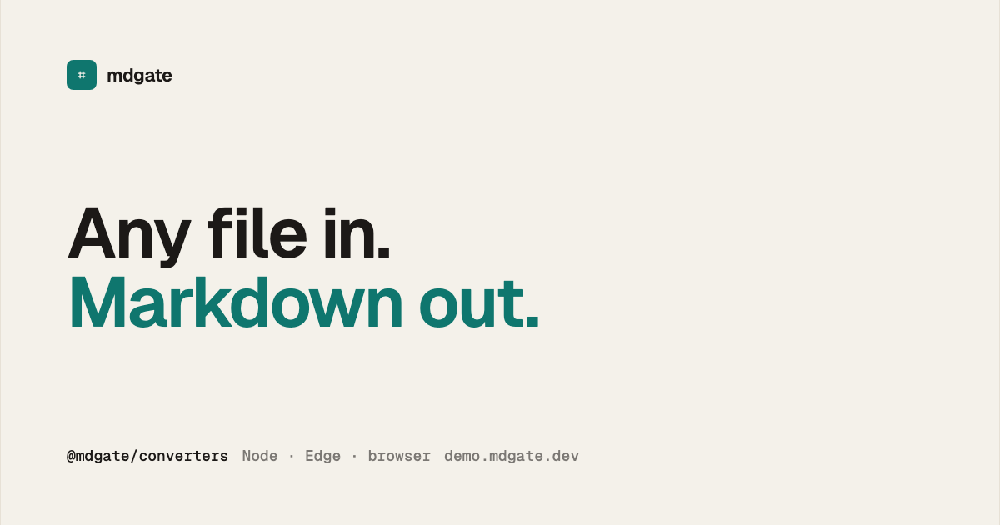

# mdgate

[](https://www.npmjs.com/package/@mdgate/converters)
[](LICENSE)
[](https://demo.mdgate.dev)

TypeScript converters that turn documents — Word, PowerPoint, Excel, OpenDocument, Apple iWork, PDF, HTML, email, notebooks, ebooks, and more — into clean GitHub-Flavored Markdown.

Works in Node, Edge, and the browser. No native addons, no WASM, no external dependencies. Pass file bytes; get Markdown.

**[Try it in your browser](https://demo.mdgate.dev)**: the demo runs the library in a Web Worker, so files are converted locally and never leave your machine.

<p align="center">
  <a href="https://demo.mdgate.dev">
    
  </a>
</p>

## Quick start

### Everything

```bash
npm i @mdgate/converters
```

```ts
import { readFile } from 'node:fs/promises';
import { toMarkdown } from '@mdgate/converters';

const bytes = new Uint8Array(await readFile('notes.docx'));
const markdown = await toMarkdown(bytes, { path: 'notes.docx' });
```

`hint.path` is only a sniff hint (needed for signature-less formats like CSV). It is never read from disk.

### One format

Same function, different import — only that parser comes along:

```bash
npm i @mdgate/docx
```

```ts
import { toMarkdown } from '@mdgate/docx';

const markdown = await toMarkdown(bytes);
```

### Compose your own set

```ts
import { create } from '@mdgate/core';
import { docx } from '@mdgate/docx';
import { pdf } from '@mdgate/pdf';

const convert = create([docx(), pdf()]);
const markdown = await convert(bytes);
```

### Images and video the local converters cannot read

Raster images, and images embedded in a PDF, need a vision callback. SVG converts locally. Video
files need a callback that accepts the whole file.

```ts
import { create } from '@mdgate/core';
import { image } from '@mdgate/image';
import { video } from '@mdgate/video';
import { ai } from '@mdgate/ai';
import { pdf } from '@mdgate/pdf';

const media = ai({
  baseURL: 'https://api.example.com/v1',
  apiKey: process.env.MY_KEY!,
  model: 'my-vision-model',
});

const convert = create([
  pdf(),
  image(media.convertImage),
  video(media.convertVideo),
]);
```

## Features

- **One output for every format.** Official converters share one Markdown dialect — same escaping, tables, heading anchors, and footnotes — whether the input was a `.doc` from 2003 or a `.xlsx` from yesterday.
- **Full document structure.** Headings, bold/italic/strikethrough, inline code and code blocks, links, bulleted/numbered/nested lists, tables with merged cells, block quotes, footnotes and endnotes, and speaker notes.
- **Content-based format detection.** The format is read from the bytes (PDF header, RTF open group, OLE stream names, ZIP package mimetype), so mislabeled files still convert. CSV and plain text have no such marker — pass `hint.path` for those.
- **Portable TypeScript.** No native addons, no WASM, no Node builtins, no external dependencies. The same `toMarkdown(bytes)` call works in Node, Cloudflare Workers, and the browser.
- **Install only what you need.** One package per format, or `@mdgate/converters` for the full set.
- **Nested conversion.** A ZIP of emails of Word docs converts through the same registry, up to a small depth limit.
- **PDF support built in.** Text is extracted locally. Embedded images are handed to the converter pool — register `image()` if you have a vision model.

## Supported formats

| Family | Extensions |
| --- | --- |
| Word | `.doc`, `.docx`, `.docm` |
| PowerPoint | `.ppt`, `.pps`, `.pot`, `.pptx`, `.pptm`, `.ppsx`, `.ppsm` |
| Excel | `.xls`, `.xlsx`, `.xlsm`, `.xlsb` |
| OpenDocument | `.odt`, `.ods`, `.odp`, `.odg` (+ templates and flat XML) |
| Apple iWork | `.pages`, `.numbers`, `.key` |
| WPS Office | `.wps`, `.wpt`, `.et`, `.ett`, `.dps`, `.dpt` |
| Hangul | `.hwp`, `.hwpx`, `.hwt`, `.hwtx` |
| Rich Text | `.rtf` |
| PDF | `.pdf` |
| HTML | `.html`, `.htm`, `.xhtml`, `.mhtml`, `.mht` |
| Email | `.eml`, `.msg`, `.mbox`, `.emlx` |
| Notebooks | `.ipynb` |
| Ebooks | `.epub`, `.fb2`, `.mobi`, `.azw`, `.azw3`, `.prc` |
| LaTeX | `.tex`, `.latex`, `.ltx` |
| Visio | `.vsd`, `.vsdx`, `.vss`, `.vst`, `.vssx`, `.vstx` |
| OneNote | `.one`, `.onetoc2`, `.onepkg` |
| Data | `.csv`, `.json`, `.jsonl`, `.xml`, `.yaml` |
| Text | `.txt`, `.md`, and source files |
| Subtitles | `.srt`, `.vtt`, `.webvtt` |
| Archives | `.zip`, `.zipx`, `.jar` |
| Images | `.jpeg`\*, `.png`\*, `.webp`\*, `.gif`\*, `.tiff`\*, `.heic`\*, `.bmp`\*, `.svg` |
| Audio | `.mp3`\*, `.wav`\*, `.m4a`\*, `.aac`\*, `.ogg`\*, `.flac`\*, `.weba`\* |
| Video | `.mp4`\*, `.m4v`\*, `.mov`\*, `.webm`\*, `.mkv`\*, `.avi`\* |

\* Needs a callback — vision for raster images (`image()`), transcription for audio (`audio()`), video understanding for `video()`. Not registered by `all()`. SVG converts locally.

## How it works

```
file bytes
  │
  ├─► sniff              → each converter scores the bytes (and optional path)
  │
  ├─► format parser      → one per family
  │         │
  │         ├─► Document → shared model: blocks, inlines, tables,
  │         │              notes, assets → GFM serializer
  │         │
  │         └─► Markdown directly (PDF text; images/audio/video via callback)
  │
  └─► nested convert     → zip / eml / … can hand inner bytes back
```

Converters that share the document model get serializer fixes once. A table-escaping fix for docx is automatically a table-escaping fix for rtf, odt, and everything else on that path.

## Errors

A conversion throws only when no meaningful Markdown could come out of the file. `ConvertError.code` names what went wrong:

```ts
import { toMarkdown, ConvertError } from '@mdgate/converters';

try {
  return await toMarkdown(bytes, { path });
} catch (error) {
  if (error instanceof ConvertError &&
      (error.code === 'encrypted' || error.code === 'unsupported')) {
    unconverted.push([path, error]);
    return;
  }
  throw error;
}
```

| `code` | Meaning |
| --- | --- |
| `unsupported` | Unknown format, or one that cannot be converted |
| `malformed` | Structurally unusable: no meaningful content could be extracted |
| `encrypted` | Encrypted or password-protected |
| `resourceLimit` | Crossed a fixed safety limit (decompression, nesting, node count) |
| `missingPart` | A part required for any meaningful output is absent |
| `io` | The file could not be read |

## Write your own converter

A converter is two functions: `sniff` says whether the bytes are yours, `convert` turns them into markdown. Most converters parse into a `Document` from `@mdgate/document` and render with `documentToMarkdown` so the Markdown dialect matches:

```ts
import type { Converter } from '@mdgate/core';
import { documentToMarkdown } from '@mdgate/document';

export function myFormat(): Converter {
  return {
    id: 'my-format',
    sniff: (bytes) => (looksLikeMyFormat(bytes) ? 2 : 0),
    convert: (bytes) => ({ markdown: documentToMarkdown(parseMyFormat(bytes)) }),
  };
}
```

Converters registered with `create()` compete by sniff score; content signatures (score 2) outrank extension hints (score 1).

## Packages

Converters — each exports a factory (for `create`) and its own `toMarkdown`:

| Package | Handles |
|---|---|
| `@mdgate/converters` | Bundle: every format below, `toMarkdown`, `all()` |
| `@mdgate/docx` | docx, docm |
| `@mdgate/doc` | doc (binary Word) |
| `@mdgate/rtf` | rtf |
| `@mdgate/pptx` | pptx, pptm, ppsx, ppsm |
| `@mdgate/ppt` | ppt, pps, pot (binary PowerPoint) |
| `@mdgate/xlsx` | xlsx, xlsm, xlsb, xls |
| `@mdgate/csv` | csv |
| `@mdgate/text` | txt, md, and source files |
| `@mdgate/data` | json, jsonl, xml, yaml |
| `@mdgate/subtitle` | srt, vtt, webvtt |
| `@mdgate/html` | html, htm, xhtml, mhtml, mht |
| `@mdgate/email` | eml, msg, mbox, emlx |
| `@mdgate/ipynb` | ipynb (Jupyter) |
| `@mdgate/odf` | odt, ods, odp, odg |
| `@mdgate/pages` | pages |
| `@mdgate/numbers` | numbers |
| `@mdgate/keynote` | key |
| `@mdgate/epub` | epub |
| `@mdgate/pdf` | pdf |
| `@mdgate/fb2` | fb2, fb2.zip |
| `@mdgate/mobi` | mobi, azw, azw3, prc |
| `@mdgate/latex` | tex, latex, ltx |
| `@mdgate/visio` | vsd, vsdx, vss, vst, vssx, vstx |
| `@mdgate/onenote` | one, onetoc2, onepkg |
| `@mdgate/hwp` | hwp, hwpx, hwt, hwtx |
| `@mdgate/wps` | wps, wpt, et, ett, dps, dpt |
| `@mdgate/zip` | zip, zipx, jar |
| `@mdgate/image` | jpeg\*, png\*, webp\*, gif\*, tiff\*, heic\*, bmp\*, svg |
| `@mdgate/audio` | mp3\*, wav\*, m4a\*, aac\*, ogg\*, flac\*, weba\* |
| `@mdgate/video` | mp4\*, m4v\*, mov\*, webm\*, mkv\*, avi\* |
| `@mdgate/ai` | Optional `image` / `audio` / `video` callbacks |

\* Needs a callback — vision for raster images (`image()`), transcription for audio (`audio()`), video understanding for `video()`. Not registered by `all()`. SVG converts locally.

Contract and shared layers:

| Package | Role |
|---|---|
| `@mdgate/core` | `create()`, the `Converter` interface, `ConvertError` |
| `@mdgate/document` | Shared document model + Markdown renderer |
| `@mdgate/containers` | Internal: ZIP/OPC, OLE (CFB), XML parsing |
| `@mdgate/office-common` | Internal: shared office-format semantics |
| `@mdgate/iwork-common` | Internal: Apple iWork IWA / Snappy / protobuf helpers |
| `@mdgate/utils` | Internal: text, byte, inflate, encoding helpers |

## Development

```bash
bun install          # also enables .githooks/pre-commit (lint + test)
bun test
bun run dev:demo
```

A committed fixture corpus under `test/fixtures/` is snapshot-tested. `test/robustness.test.ts` mutation-tests fixtures, and `test/abuse.test.ts` checks the safety limits.

## License

[MIT](LICENSE)
